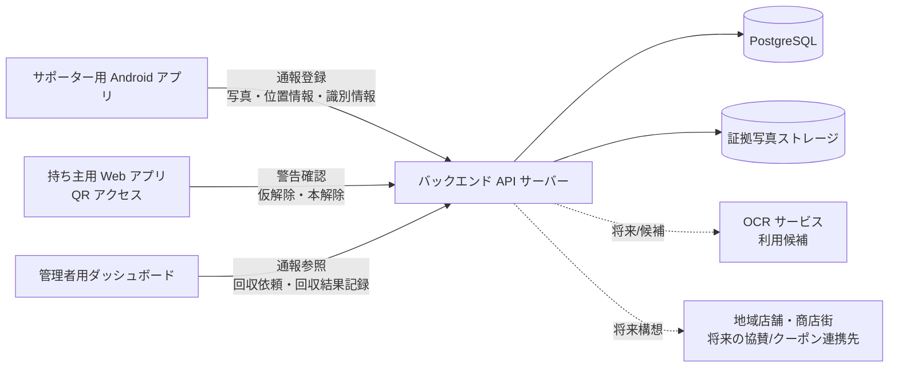
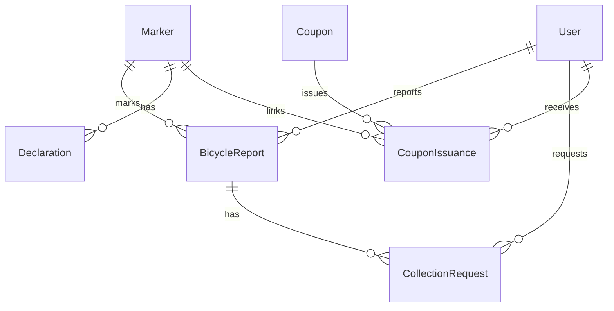
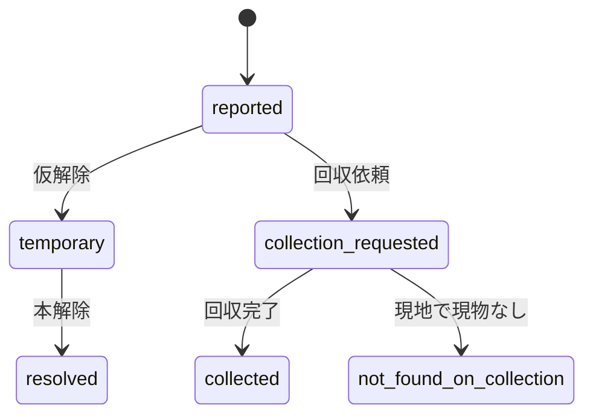
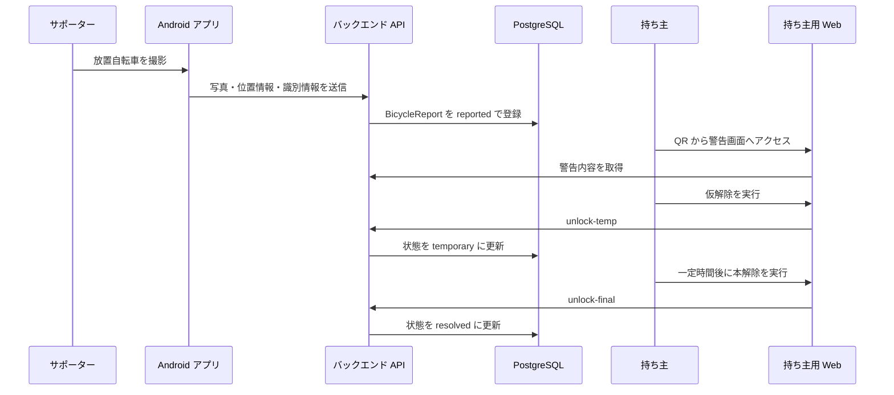
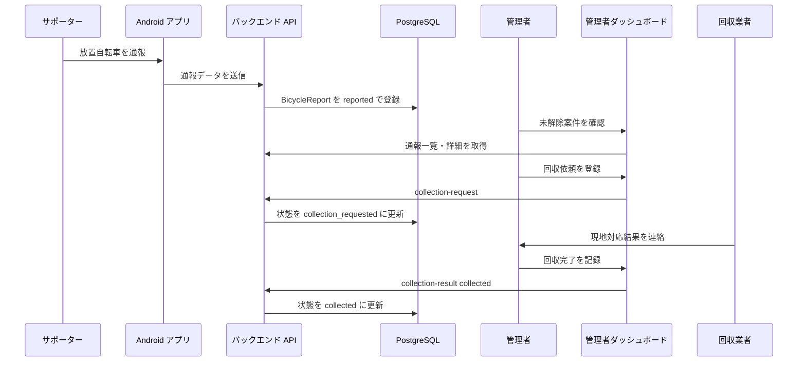
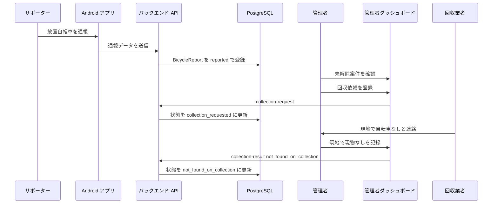

# 基本設計仕様書

**プロジェクト:** NO-Houchi Bicycle Net
**バージョン:** 1.6

## 1. 概要と目的

本書は、NO-Houchi Bicycle Net の価値を伝えるための試作品に向けた基本設計を記述する。

### 1.1 背景

大阪府北区のような都市部では、駅前や商業地周辺に放置自転車が発生しやすく、巡回、現地確認、警告、回収依頼、回収結果の記録に行政や委託事業者の作業負荷がかかる。

従来の対応では、放置自転車を発見してから行政側が状況を把握するまでに時間がかかり、持ち主が自発的に移動するための導線も弱い。結果として、現地確認や回収作業の空振り、対応履歴の分散、住民参加の不足が課題となる。

### 1.2 ソリューションの目的

NO-Houchi Bicycle Net は、放置自転車への対応を以下の一連の流れとしてつなげることを目的とする。

- サポーターが放置自転車を発見し、Android アプリから写真、位置情報、識別情報を付けて通報する
- 持ち主がマーカーの QR から警告内容を確認し、仮解除と本解除を行う
- 持ち主による解除が行われない場合、管理者が未解除案件を確認し、回収依頼を行う
- 回収結果を「回収完了」または「現地で現物なし」として記録する

これにより、通報から解決または回収対応までを一つの運用として可視化し、ソリューションの有効性を短時間で理解できるようにする。

### 1.3 ビジネスモデル

本ソリューションは、行政委託型と地域協賛型を組み合わせたハイブリッド型のビジネスモデルを想定する。

行政委託型では、自治体が放置自転車対策の効率化を目的として、システム導入、運用支援、回収依頼管理に関する費用を負担する。これにより、通報受付、所有者への警告、未解除案件の回収依頼、回収結果記録までを一元的に管理できるようにする。

地域協賛型では、商店街や地域店舗がポイントやクーポン等のインセンティブを提供し、サポーターの通報参加や持ち主の自発的な移動を促進する。これにより、放置自転車対策を単なる取り締まりではなく、地域参加型の改善活動として位置づける。

試作品では、行政委託型を運営基盤とし、地域協賛型はポイント/クーポン要素の存在を示す範囲に留める。協賛店舗管理、クーポン精算、利用履歴管理、店舗システム連携は将来拡張として扱う。

事業性の説明では、単に「便利になる」ではなく、自治体が負担している現行コストのどこを削減し、その代わりにどこへ新規投資が必要かを示す必要がある。そのため、以下では北区の駅前重点エリアで年 2,400 件（月 200 件）を処理する小規模導入を想定した一次試算を置く。実案件では、対象駅数、委託単価、回収事業者の契約形態、実際の解除率をヒアリングして上書きする前提とする。

#### 1.3.1 試算の前提

| 項目 | 試算前提 |
| --- | --- |
| 対象範囲 | 北区の駅前重点エリアを想定した 1 区導入 |
| 年間処理件数 | 2,400 件（200 件/月） |
| 職員人件費 | 2,500 円/時 |
| 現地確認・回収委託の実働単価 | 4,000 円/時 |
| 現行の持ち主による自主解消率 | 20% |
| 導入後の持ち主による自主解消率 | 45% |
| サポーター通報で置き換えられる初動確認 | 全件の 50% |
| 事務処理時間 | 現行 12 分/件 → 導入後 4 分/件 |

補足:
現行業務では、発見、警告対象の台帳転記、紙や電話ベースでの回収依頼、回収結果の再入力が分断されやすい。NO-Houchi Bicycle Net では、通報起点で案件を起票し、持ち主解除と回収依頼を同一案件で追跡することで、初動確認、事務入力、不要な回収出動の 3 点を主な削減対象とする。

#### 1.3.2 削減できるコスト

| 削減対象 | 現行の考え方 | 導入後の改善 | 年間削減額（試算） |
| --- | --- | --- | --- |
| 初動の現地確認コスト | 全件を巡回や現地確認で把握 | 年間 2,400 件のうち 50% をサポーター通報で代替。1 件あたり 12 分相当の現地確認を削減 | 960,000 円 |
| 事務処理コスト | 受付、台帳転記、回収依頼、結果反映を手作業で実施 | 1 件あたり 8 分短縮（12 分 → 4 分） | 800,000 円 |
| 回収出動コスト | 自主解消率 20% のため 1,920 件が回収対象 | 自主解消率 45% に上がり、回収対象が 1,320 件に減少。600 件分の出動を回避 | 1,500,000 円 |

年間の粗削減額は **3,260,000 円/年** と試算する。

計算式:

- 初動確認削減: `2,400 件 × 50% × (12/60 時間) × 4,000 円 = 960,000 円`
- 事務処理削減: `2,400 件 × (8/60 時間) × 2,500 円 = 800,000 円`
- 回収出動削減: `(2,400 件 × (1 - 20%)) - (2,400 件 × (1 - 45%)) = 600 件`
- 回収出動削減額: `600 件 × 2,500 円 = 1,500,000 円`

#### 1.3.3 新たにかかるコスト

| 費目 | 内容 | 年額または初期費用 |
| --- | --- | --- |
| 初期導入支援 | 要件調整、初期設定、操作説明、試験運用立ち上げ | 600,000 円 |
| QR マーカー初期配布 | マーカー、印刷物、周知用資材の初回ロット | 150,000 円 |
| 導入時 PM・効果測定 | 定例運営、月次レポート設計、初期効果測定 | 550,000 円 |
| システム利用・保守 | アプリ/管理画面/Backend の保守、問い合わせ対応 | 840,000 円/年 |
| クラウド・ストレージ | API 実行、DB、画像保存、監視の最小構成 | 240,000 円/年 |
| QR マーカー補充 | 破損・交換・追加配布分 | 120,000 円/年 |
| 参加促進費 | 小規模なクーポン原資、協賛調整の事務費 | 180,000 円/年 |

初期費用は **1,300,000 円**、年間運用費は **1,380,000 円/年** を見込む。

#### 1.3.4 年間収支イメージ

| 指標 | 金額 |
| --- | --- |
| 年間の粗削減額 | 3,260,000 円 |
| 年間運用費 | 1,380,000 円 |
| 年間の純削減額 | 1,880,000 円 |
| 初期費用 | 1,300,000 円 |
| 初年度の差引効果 | 580,000 円 |

この前提では、初年度でも黒字化し、2 年目以降は **約 188 万円/年** の純削減が見込める。初期費用 130 万円に対して、年間純削減額 188 万円で回収できるため、投資回収期間はおおむね **8 か月程度** となる。

提案時には、以下の 3 点をセットで示すと説明しやすい。

- 行政にとっての価値: 「回収件数そのものを減らし、委託出動と事務処理を同時に削減する」
- 地域にとっての価値: 「商店街協賛は高額補助ではなく、小規模な参加促進費で十分に始められる」
- 実証で確認すべき指標: 「自主解消率」「回収出動回避件数」「1 件あたり事務時間」の 3 指標を追えば、次年度予算要求の根拠を作れる」

### 1.4 試作品の概要

本試作品では、以下の 3 つのストーリーを主要シナリオとして扱う。

1. **通報 → 持ち主が解除して解決**
2. **通報 → 持ち主が戻らない → 回収依頼 → 正常回収**
3. **通報 → 持ち主が戻らない → 回収依頼 → 現地で自転車なし（未回収記録）**

Android アプリ、持ち主用 Web アプリ、管理者用ダッシュボード、バックエンド API を接続し、放置自転車対応の最小運用フローを示す。

## 2. システム構成

本システムは、利用者向けの 3 つのクライアントと、共通のバックエンド API を中心に構成する。

### 2.1 コンポーネント

- **サポーター用 Android アプリ**: 放置自転車の発見、撮影、位置情報付き通報、QR/ポイント要素の提示を行う
- **持ち主用 Web アプリ（QR アクセス）**: マーカーの QR からアクセスし、警告確認、仮解除、本解除を行う
- **管理者用ダッシュボード**: 通報一覧の確認、未解除案件の把握、回収依頼、回収結果の記録を行う
- **バックエンド API サーバー**: 通報登録、通報参照、解除状態管理、回収依頼状態管理、操作履歴記録を行う
- **PostgreSQL**: 通報、マーカー、ユーザー、解除宣言、回収依頼などの構造化データを保持する
- **証拠写真ストレージ**: 通報時に撮影された写真を保存する
- **地域店舗・商店街**: 将来の地域協賛、クーポン発行、利用促進の連携先とする

### 2.2 技術スタック

- **Android アプリ**: Android (Kotlin)
- **Web アプリ**: React / Next.js
- **バックエンド**: Node.js
- **データベース**: PostgreSQL
- **ストレージ**: 証拠写真保存用ストレージ
- **外部連携**: OCR 連携は利用候補とするが、試作品では必須要件に含めない

## 3. 機能要件

### 3.1 試作品の必須機能

#### サポーター用 Android アプリ

- 放置自転車を撮影して通報できる
- 通報時に位置情報と識別情報を送信できる
- 現地での利用イメージとして QR 要素を扱える
- 参加促進のため、ポイント/クーポン要素の存在を簡潔に示せる

#### 持ち主用 Web アプリ

- QR から対象の警告内容を確認できる
- 持ち主が仮解除を申請できる
- 一定時間経過後に本解除できる
- 将来の地域協賛として、クーポン提示導線の存在を示せる

#### 管理者用ダッシュボード

- 通報一覧を確認できる
- 未解除案件を確認できる
- 一定時間内に持ち主による解除が行われなかった通報を、回収依頼対象として扱える
- 回収結果を「回収完了」または「現地で現物なし」として記録できる

#### バックエンド API サーバー

- Android アプリからの通報登録を受け付ける
- 管理画面向けに通報一覧・詳細を提供する
- Owner Web 向けに警告参照、仮解除、本解除を提供する
- 回収依頼状態および回収結果を管理する
- 通報、仮解除、本解除、回収依頼、回収結果更新の最小限の操作履歴を保持する

### 3.2 将来構想として扱う機能

以下は構想上は重要だが、今回の試作品では必須要件に含めない。削除するものではなく、試作品で価値を確認した後の拡張候補としてドキュメント上に残す。

- **ブラックリスト管理の本実装**: `not_found_on_collection` などの未回収記録を将来の不正対策に活用する候補とする。今回の試作品では、ブラックリスト照合や即時撤去アラートまでは実装しない。
- **ヒートマップや高度分析**: 通報地点の可視化、時空間分析、行政向けエビデンス出力は将来拡張とする。今回の試作品では、管理画面の一覧確認を優先する。
- **回収後の保管・返還管理**: 回収後の保管場所、返還手続き、処分記録の詳細管理は扱わない。今回の試作品では、回収結果を記録して案件を閉じるところまでとする。
- **ポイントやクーポンの詳細インセンティブ設計**: ポイントやクーポンの存在は示すが、ランキング、利用履歴、店舗連携、発行条件、精算処理の詳細設計は今回スコープ外とする。
- **不正検知の高度化**: 短時間連続通報、同一端末の異常行動、常習犯検知などは将来の監査・分析機能として扱う。今回の試作品では、最低限の操作履歴のみを残す。
- **撮影品質判定・OCR 精度向上**: ピンぼけ判定、暗所判定、ガイドフレーム、OCR 精度改善は将来拡張とする。今回の試作品では、写真・位置情報・識別情報を通報できることを優先する。
- **ジオフェンシング通報制限**: 駐輪場、私有地、通報禁止エリアの判定は将来拡張とする。今回の試作品では、通報フローの成立を優先する。
- **警察・店舗などの外部連携**: 盗難届照合、警察連携、商店街店舗とのクーポン連携は将来構想として残す。今回の試作品では、外部システムとの本連携は行わない。
- **本番運用レベルの監視・可用性**: 99.9% 可用性、詳細アラート、ログ集約基盤などは本番化フェーズで扱う。今回の試作品では、原因追跡に必要な最低限のログを対象とする。
- **マイクロサービス前提の拡張構成**: 他自治体展開や大規模運用を見据えた分割構成は将来検討とする。今回の試作品では、4 コンポーネントをつなぐ最小構成を優先する。

## 4. 非機能要件

| 区分 | 要件 |
| --- | --- |
| 応答性 | モバイル端末で利用した際に、主要画面や主要操作で大きな待ち時間が発生しないこと |
| 通信保護 | クライアントとサーバー間の通信は HTTPS を前提とすること |
| 操作履歴 | 通報、仮解除、本解除、回収依頼、回収結果更新の最低限の記録を残すこと |
| プライバシー配慮 | サポーターの連続的な行動履歴を過剰に保持せず、通報地点など必要最小限の情報のみ扱うこと |
| モバイル利用性 | サポーターと持ち主がスマートフォン画面で主要操作を完了できること |
| 写真表示 | 低速回線でも警告確認ができるよう、写真は必要に応じて軽量表示や段階的表示を検討すること |
| 可用性・監視 | 試作品では原因追跡に必要な最低限のログを対象とし、本番運用レベルの監視設計は将来フェーズで拡張すること |

## 5. データモデル

基本設計上の主要エンティティは以下とする。詳細なフィールド定義は [データモデル定義](./data-model.md) を参照する。

- **User**: サポーターまたは管理者を表す
- **Marker**: QR で参照される識別子を保持する
- **BicycleReport**: 通報情報、位置情報、画像、状態を保持する
- **Declaration**: 仮解除・本解除に関する情報を保持する
- **CollectionRequest**: 回収依頼および回収結果の履歴を保持する
- **Coupon**: 地域協賛型で提供されるクーポン情報を保持する将来拡張モデル
- **CouponIssuance**: クーポン発行、利用状態、有効期限を保持する将来拡張モデル

### 5.1 状態遷移

試作品で明示する主要状態は以下とする。

- `reported`
- `temporary`
- `resolved`
- `collection_requested`
- `collected`
- `not_found_on_collection`

想定する最小の状態遷移は以下の 3 系統である。

## 6. ユーザインタフェース設計

本章では、試作品でユーザーが対話する主要画面と操作を定義する。持ち主用 Web アプリの詳細なワイヤーフレームは [Owner Web ワイヤーフレーム](./wireframes-owner.md) を参照する。

### 6.1 サポーター用 Android アプリ

- 放置自転車を撮影する画面を提供する
- GPS 位置情報と識別情報を通報データとして送信する
- 通報完了後、QR やポイント要素の存在を簡潔に示す
- 将来的には、撮影品質ガイド、ジオフェンス警告、ランキングやポイント履歴を追加できる余地を残す

### 6.2 持ち主用 Web アプリ

- QR からアクセスした持ち主に、写真、警告ステータス、報告日時、位置、OCR で取得した識別情報を表示する
- 仮解除を行う主要アクションボタンを表示する
- 仮解除後、本解除が可能になる時刻と期限を表示する
- 本解除ボタンは、一定時間経過後に実行可能にする
- QR 無効、対象データなし、サーバーエラーなどのエラー状態を表示する
- 将来の地域協賛として、クーポン提示や利用導線を追加できる余地を残す

### 6.3 管理者用ダッシュボード

- 通報一覧を表示し、状態や日時で確認できるようにする
- 未解除案件を把握し、回収依頼対象として扱えるようにする
- 回収依頼の登録操作を提供する
- 回収業者の現地結果を受けて、「回収完了」または「現地で現物なし」を記録できるようにする
- 将来的には、ヒートマップ、ブラックリスト、保管・返還管理を追加できる余地を残す

## 7. データフロー

### 7.1 シナリオ A: 持ち主が解除して解決する場合

### 7.2 シナリオ B: 回収依頼後に正常回収される場合

### 7.3 シナリオ C: 回収依頼後に現地で自転車が見つからない場合

### 7.4 将来拡張: 地域協賛・クーポン連携

地域協賛型では、サポーターの参加や持ち主の自発的な移動を促すため、クーポン発行と利用情報を地域店舗・商店街と連携する可能性がある。試作品では、ポイント/クーポン要素の存在を示す範囲に留め、発行条件、利用履歴、店舗精算、外部システム連携は将来構想とする。

## 8. プロトコルとインタフェース

### 8.1 通信方式

- クライアントとバックエンド API の通信は HTTPS + REST API を前提とする
- 管理者/サポーター向け API は JWT ベアラートークンによる認証を前提とする
- 持ち主向け Owner Web API は、QR コード経由の公開アクセスを前提とする
- API の詳細仕様は [API 仕様書](./api-spec.md) と [OpenAPI 定義](./openapi.yaml) を参照する

### 8.2 主要 API

| API | 用途 |
| --- | --- |
| `POST /api/reports` | サポーターが放置自転車通報を作成する |
| `GET /api/reports` | 管理者が通報一覧を取得する |
| `GET /api/reports/{id}` | 管理者が通報詳細を取得する |
| `POST /api/owner/markers/{code}/unlock-temp` | 持ち主が仮解除を実行する |
| `POST /api/owner/markers/{code}/unlock-final` | 持ち主が本解除を実行する |
| `POST /api/reports/{id}/collection-request` | 管理者が回収依頼を登録する |
| `PATCH /api/reports/{id}/collection-result` | 管理者が回収結果を記録する |

### 8.3 外部・将来連携

- **OCR 連携**: 防犯登録番号や識別情報の抽出に利用する候補とするが、試作品では必須要件に含めない
- **地域店舗・商店街連携**: クーポン発行、利用、精算、協賛店舗管理は地域協賛型の将来構想として扱う
- **警察連携**: 盗難届照合などは完成形に向けた構想として残すが、試作品では扱わない

---

**更新履歴:**

- v1.6: ビジネスモデル節に、前提条件・削減対象・導入運用費・年間収支を含む一次試算を追加
- v1.5: 基本設計仕様書を 8 章構成へ再編し、行政委託型 + 地域協賛型のハイブリッドモデル、UI 設計、データフロー図、プロトコル/インタフェースを整理
- v1.4: 今回スコープ外の機能を将来構想として明確化
- v1.3: `main` の更新を取り込みつつ、試作品向けにスコープを再整理し、回収依頼・回収結果記録まで含む最小運用フローへ改訂
- v1.2: QR 再スキャンによる本解除仕様・クーポンの自動発行を反映
- v1.1: 試作品向けにスコープを再整理し、回収依頼・回収結果記録まで含む最小運用フローへ改訂
- v1.1: 中間発表 Q&A 反映（持続可能性、法的安全性、常習犯対策、品質平準化、段階導入計画）
- v1.0: D2 班 中間発表フィードバック（OCR・タイムラグ機能・ブラックリスト）を反映
