# 手動動作確認レポート（2026-04-27）

## 実行環境

- 日付: 2026-04-27
- ブランチ: `main`
- Node.js: `v22.15.0`
- npm: `10.9.2`
- Backend API: `http://localhost:3000`
- Owner Web: `http://localhost:3001`
- Admin Dashboard: `http://localhost:3002`
- スクリーンショット保存先: `docs/testing/screenshots/2026-04-27/`

## 実装状況サマリ

| コンポーネント | 確認した現状 |
| --- | --- |
| Backend | Fastify + Prisma API、認証、bikes/reports/owner 系API、回収依頼APIの実装とテストを確認。ブラウザ確認時の `/api/reports` は 500 応答。 |
| Owner Web | マーカー詳細、仮解除、本解除、クーポン表示までブラウザで確認。データはインメモリストア。 |
| Admin Dashboard | 通報一覧/詳細は Backend API 取得経由だが、今回の環境では API 500 によりエラー表示。未解除案件、回収依頼、回収結果記録はモック画面として操作確認。 |
| Android App | 現在のツリーでは未確認。 |

## 実行コマンド

| 対象 | コマンド | 結果 |
| --- | --- | --- |
| Backend | `TMPDIR=/tmp npm test -- --run` | 成功。48 tests passed。 |
| Backend | `TMPDIR=/tmp npm run build` | 成功。 |
| Backend | `TMPDIR=/tmp npm run dev` | 起動。`/api/reports` は 500 応答。 |
| Owner Web | `TMPDIR=/tmp npm test -- --runInBand` | 成功。3 tests passed。 |
| Owner Web | `TMPDIR=/tmp npm run type-check` | 成功。 |
| Owner Web | `TMPDIR=/tmp npm run lint` | 成功。ただし `` 利用警告あり。 |
| Owner Web | `TMPDIR=/tmp npm run build` | 成功。 |
| Owner Web | `TMPDIR=/tmp npm run dev` | 起動。 |
| Admin Dashboard | `TMPDIR=/tmp npm test -- --runInBand` | 成功。13 tests passed。 |
| Admin Dashboard | `TMPDIR=/tmp npm run type-check` | 成功。 |
| Admin Dashboard | `TMPDIR=/tmp npm run lint` | 成功。 |
| Admin Dashboard | `TMPDIR=/tmp npm run build` | 成功。 |
| Admin Dashboard | `TMPDIR=/tmp npm run dev` | 起動。 |

## Owner Web 動作確認

| No. | 操作 | 期待結果 | 実結果 | スクリーンショット |
| --- | --- | --- | --- | --- |
| 1 | `http://localhost:3001/markers/ABC123` を表示 | 通報概要と仮解除ボタンが表示される | 表示された | 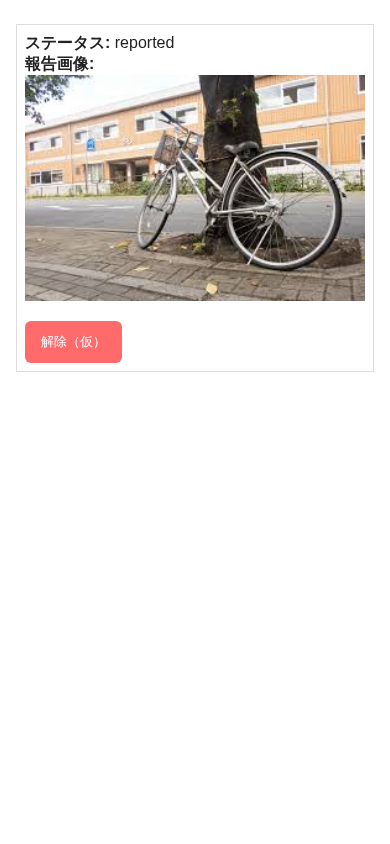 |
| 2 | `解除（仮）` を押下 | 仮解除完了メッセージと仮解除状態が表示される | `仮解除しました` が表示された | 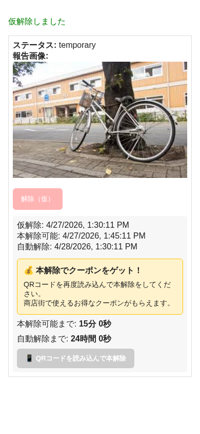 |
| 3 | テストAPIで本解除可能時刻を過去化し、画面を再読み込み | 本解除可能な状態になる | 本解除導線が有効な状態になった | 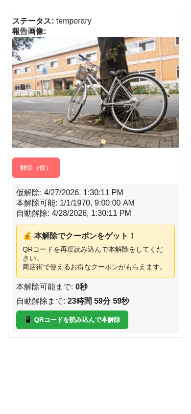 |
| 4 | 本解除APIを実行し、画面を再読み込み | `resolved` 状態とクーポンが表示される | `resolved` とクーポンが表示された |  |

## Admin Dashboard 動作確認

| No. | 操作 | 期待結果 | 実結果 | スクリーンショット |
| --- | --- | --- | --- | --- |
| 1 | `http://localhost:3002/` を表示 | Backend API から通報一覧を取得して表示する | Backend `/api/reports` が 500 のため、API取得失敗メッセージを表示 | 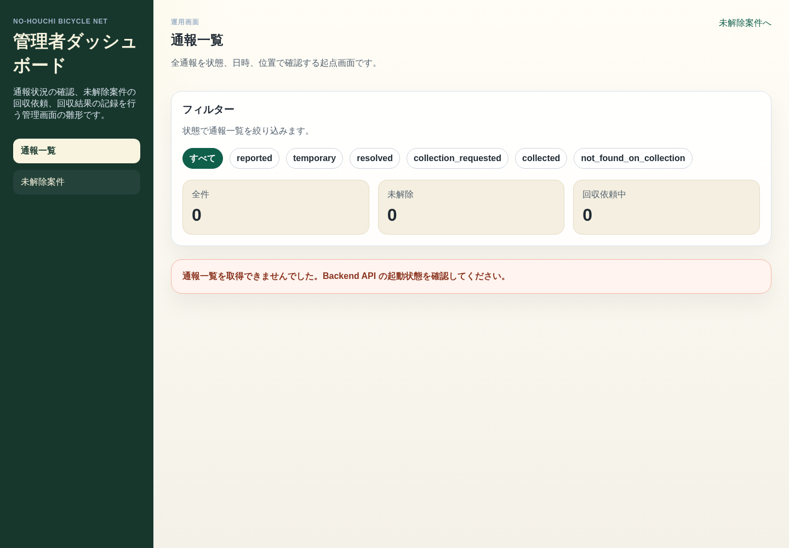 |
| 2 | 状態フィルター `resolved` を選択 | `?status=resolved` で一覧を絞り込む | URLは切り替わり、API取得失敗メッセージを表示 | 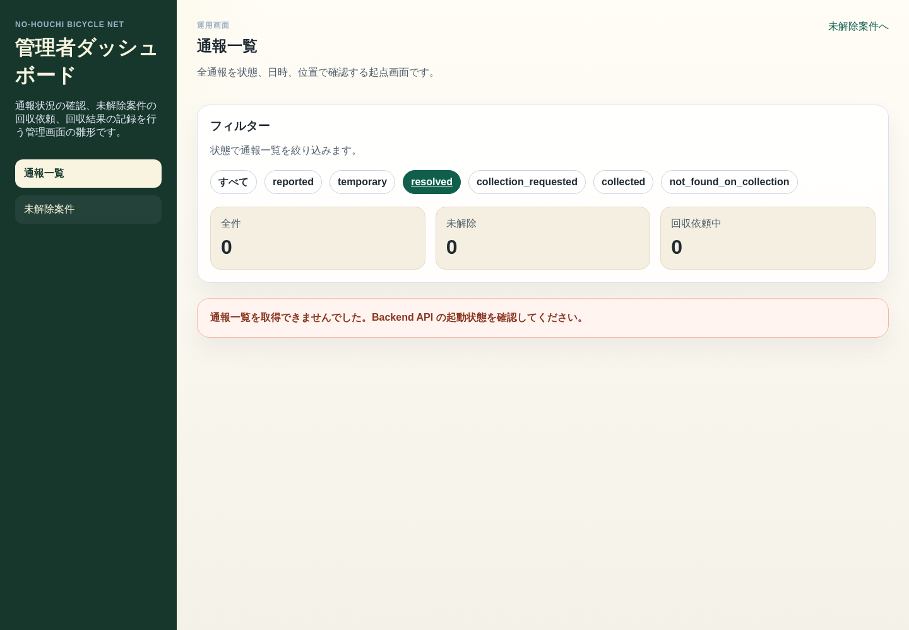 |
| 3 | `http://localhost:3002/reports/R-003` を表示 | Backend API から詳細を取得して表示する | Backend API 取得失敗メッセージを表示 | 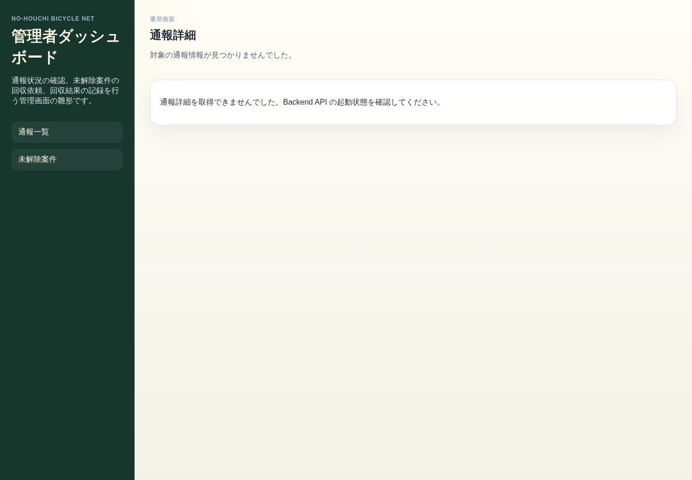 |
| 4 | `http://localhost:3002/unresolved` を表示 | 未解除案件が表示される | モックの reported / temporary 案件が表示された | 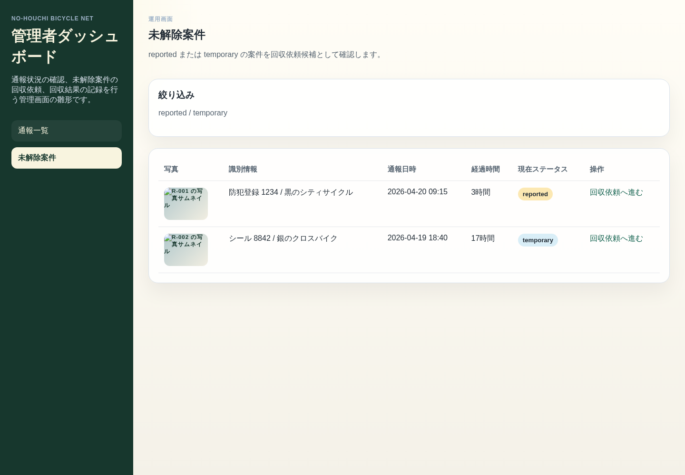 |
| 5 | `http://localhost:3002/collection-request/R-001` を表示 | 回収依頼フォームが表示される | 対象概要と依頼メモ入力欄が表示された | 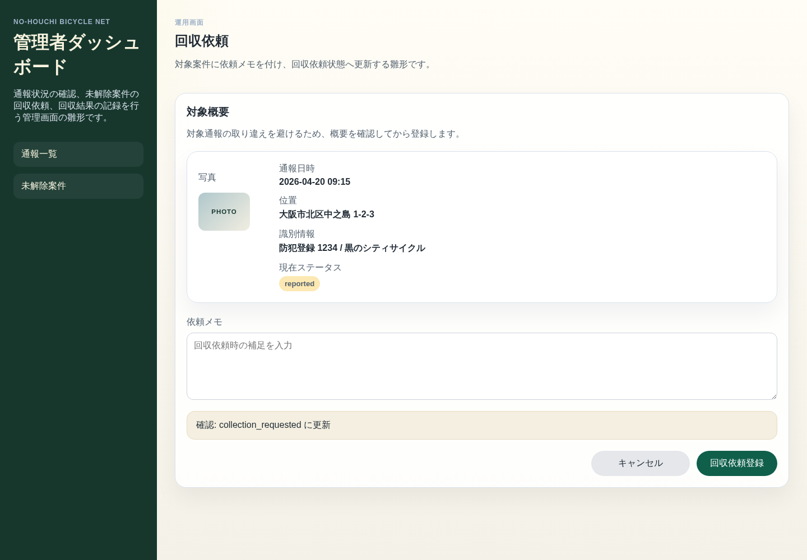 |
| 6 | 依頼メモを入力して `回収依頼登録` を押下 | 登録完了メッセージが表示される | モック登録完了メッセージが表示された | 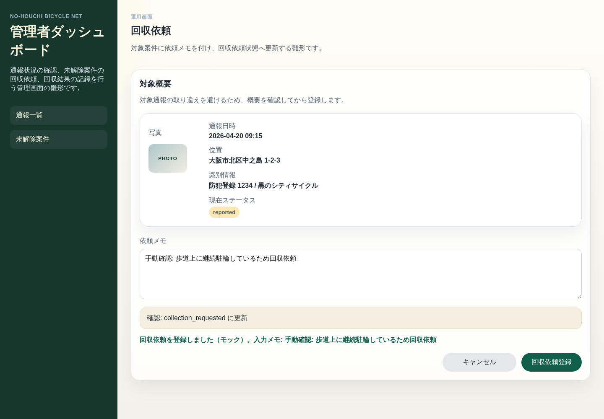 |
| 7 | `http://localhost:3002/collection-result/R-003` を表示 | 回収結果記録フォームが表示される | 結果選択と結果メモ入力欄が表示された | 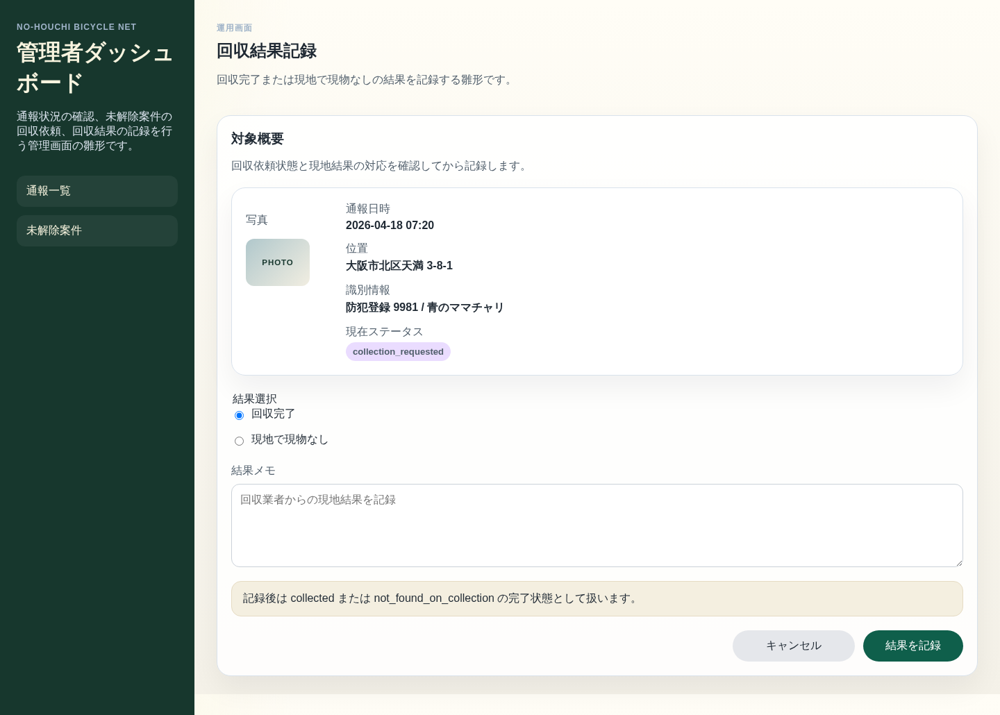 |
| 8 | `現地で現物なし` を選択し、メモを入力 | 選択状態と入力内容が反映される | 選択とメモ入力が反映された | 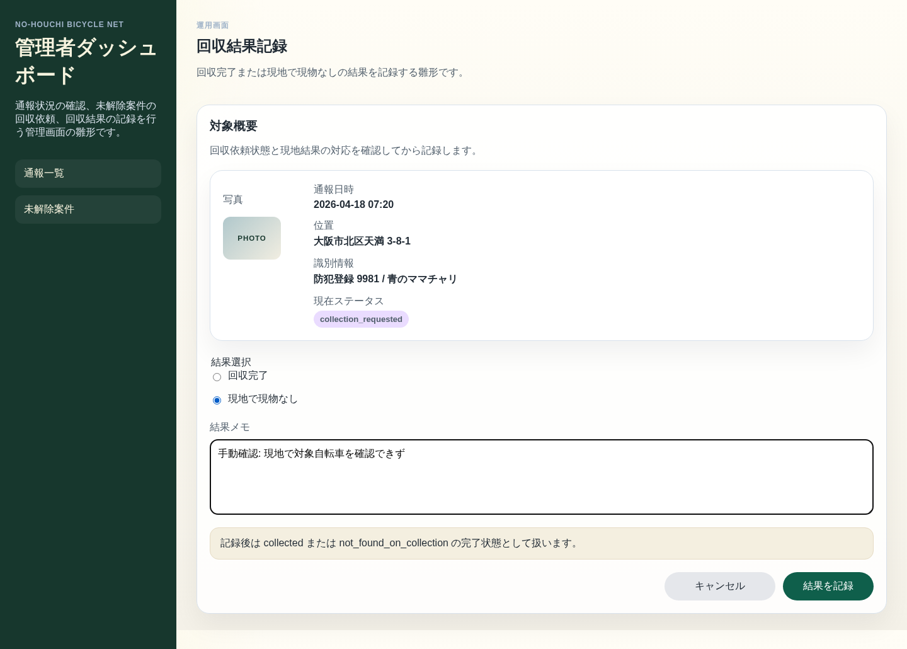 |
| 9 | `結果を記録` を押下 | `not_found_on_collection` の登録完了メッセージが表示される | モック登録完了メッセージが表示された | 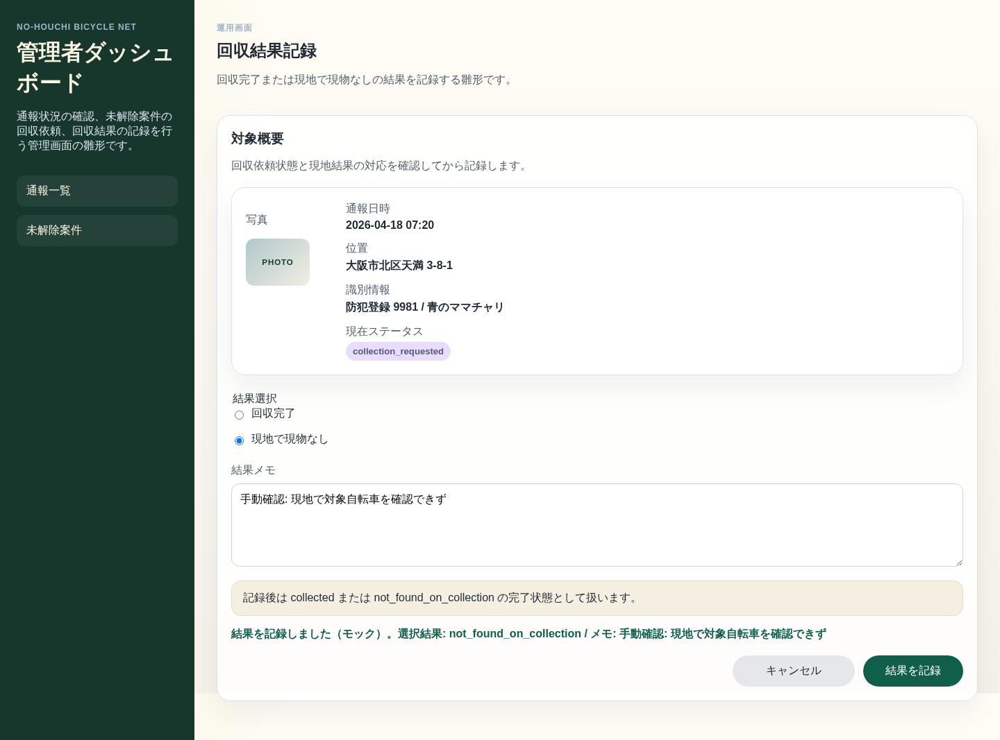 |
| 10 | `回収完了` を選択して `結果を記録` を押下 | `collected` の登録完了メッセージが表示される | モック登録完了メッセージが表示された | 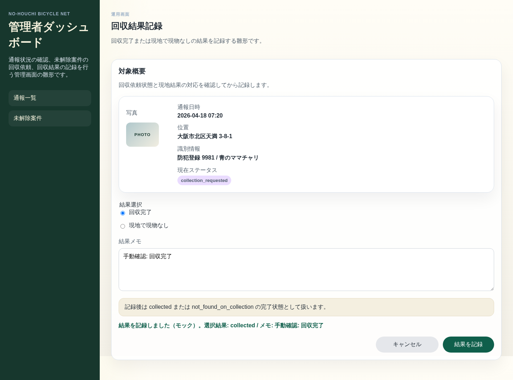 |

## 既知の注意点

- `TMPDIR=/tmp` を付けない場合、Jest/Vitest の一時ファイル作成先が Windows 側 read-only 扱いになり失敗することがある。
- Owner Web の lint/build では [ReportSummary.tsx](../../apps/owner-web/components/owner/ReportSummary.tsx) の `` 利用に対する `@next/next/no-img-element` 警告が出る。終了コードは成功。
- Admin Dashboard の通報一覧/詳細は Backend API 連携済みだが、今回の環境では Backend `/api/reports` が 500 を返したため、API連携成功画面は確認できていない。
- Admin Dashboard の回収依頼・回収結果記録は現状モック登録で、DB永続化や Backend への更新は行われない。
- Android App は未確認。

## 未実施・制約

- 実機カメラを使ったQR読み取りは未実施。本解除はテストAPIと本解除APIでE2E相当に確認した。
- 実DB永続化を伴う Backend / Admin Dashboard の一連の運用シナリオは未確認。
- Android 実機またはエミュレータでの動作確認は未実施。

## 差分確認メモ

- 作成物は本レポートと `docs/testing/screenshots/2026-04-27/` 配下のスクリーンショット。
- 作業開始前から `apps/owner-web/package-lock.json`、`backend/package-lock.json`、`.codex` に未コミット変更または未追跡ファイルがあったため、これらは変更・巻き戻ししていない。
