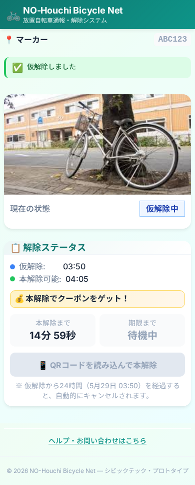
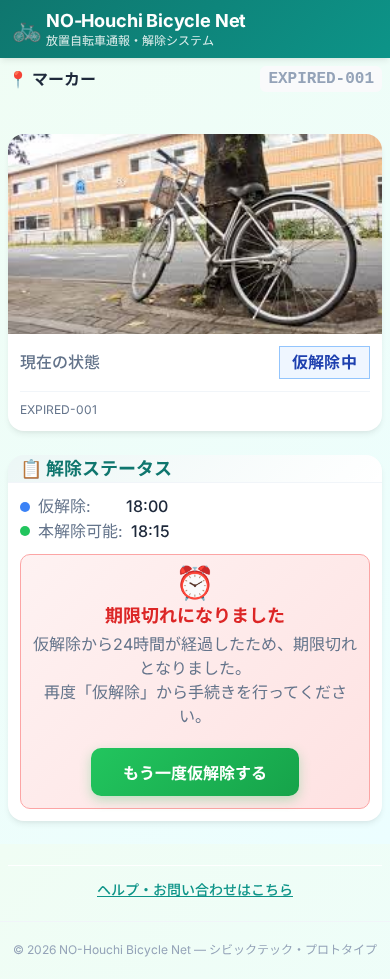

# Manual Verification — Issue #109 仮解除期限ロジック整合

- 確認日: 2026-05-28
- 対象: Owner Web / Backend の仮解除有効期限ロジック
- 作業ブランチ: `codex/issue-109-owner-expiry-alignment`

## 実行コマンド

- `cd backend && TMPDIR=/tmp npm test -- --run test/owner.spec.ts`
- `cd backend && TMPDIR=/tmp npm test -- --run`
- `cd apps/owner-web && npm test -- --runInBand __tests__/api/ownerMarkers.test.ts`
- `cd apps/owner-web && npm test`
- `cd apps/owner-web && npm run type-check`
- `cd apps/owner-web && npm run lint`

## 画面確認

| No. | 確認内容 | 結果 | スクリーンショット |
| --- | --- | --- | --- |
| 1 | `ABC123` で仮解除を実行し、`expiresAt` 表示が仮解除時刻から24時間基準で出ることを確認 | OK |  |
| 2 | 期限切れ declaration を読み込んだ際に、再仮解除導線付きの期限切れ表示になることを確認 | OK |  |

## 補足

- No.1 は owner-web 開発サーバー上で実際に `仮解除を申請する` を押して確認。
- No.2 は期限切れ状態の UI 表示確認を目的に、Playwright で `GET /api/owner/markers/EXPIRED-001` のレスポンスを差し替えて撮影。
- `npm run lint` は既存の `components/owner/ReportSummary.tsx` に対する `@next/next/no-img-element` 警告のみで、新規警告やエラーはなし。
