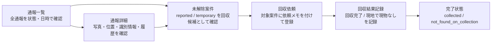

# Admin Dashboard — 画面構成図

## 目的

区役所職員が放置自転車の通報状況を確認し、未解除案件の回収依頼と回収結果記録までを行うための管理画面構成を整理する。

今回の成果物は詳細UIや実装コンポーネントではなく、Issue 20 の画面設計レビューに使う画面間の関係と操作責務を示す。

## Figma / FigJam

- [Admin Dashboard 画面構成](https://www.figma.com/online-whiteboard/create-diagram/ace97d14-466d-4651-87e9-afd38b1cb306?utm_source=chatgpt&utm_content=edit_in_figjam&oai_id=&request_id=d1011b99-3305-486a-9208-f39341a78e09)

## 対象画面

1. 通報一覧
   - 役割: 全通報を状態、日時、位置で確認する起点画面
   - 表示要素: 写真サムネイル、通報日時、位置、識別情報、ステータス
   - 操作: 通報詳細を開く、状態で絞り込む

2. 未解除案件
   - 役割: `reported` または `temporary` の案件を回収依頼候補として確認する画面
   - 表示要素: 経過時間、現在ステータス、位置、識別情報、写真サムネイル
   - 操作: 回収依頼画面へ進む

3. 回収依頼
   - 役割: 対象案件に依頼メモを付け、回収依頼状態へ更新する画面
   - 表示要素: 対象通報の概要、依頼メモ、依頼登録確認
   - 操作: 回収依頼を登録し、ステータスを `collection_requested` にする

4. 回収結果記録
   - 役割: 回収業者からの現地結果を受けて、案件の最終結果を記録する画面
   - 表示要素: 対象通報の概要、回収依頼状態、結果メモ、結果選択
   - 操作: `collected` または `not_found_on_collection` を記録する

## 補助導線

- 通報詳細
  - 役割: 通報一覧から個別通報の写真、位置、識別情報、操作履歴を確認する補助導線
  - 表示要素: 写真、通報日時、位置、識別情報、現在ステータス、履歴
  - 操作: 未解除案件として確認する、一覧へ戻る

## 画面遷移

## 参照API

| 画面 | API | 用途 |
| --- | --- | --- |
| 通報一覧 | `GET /api/reports` | 管理者向けの通報一覧を取得する |
| 通報詳細 | `GET /api/reports/{id}` | 個別通報の詳細を取得する |
| 回収依頼 | `POST /api/reports/{id}/collection-request` | 未解除案件を回収依頼対象にする |
| 回収結果記録 | `PATCH /api/reports/{id}/collection-result` | 回収完了または現地で現物なしを記録する |

## UI/UX メモ

- 状態ラベルは色だけに依存せず、`reported`、`temporary`、`collection_requested` などのテキストを併記する。
- 通報一覧と未解除案件では、職員が優先度を判断できるように通報日時と経過時間を近くに表示する。
- 回収依頼と回収結果記録は、誤操作を避けるため対象通報の概要を確認できる構成にする。
- ブラックリスト、ヒートマップ、保管・返還管理、詳細分析は今回の試作品スコープ外とし、将来構想として扱う。

## 受入基準

- 通報一覧、未解除案件、回収依頼、回収結果記録の画面責務が明示されている。
- 通報詳細から未解除案件確認へ進む導線が整理されている。
- 回収依頼後のステータス `collection_requested` と、結果記録後の `collected` / `not_found_on_collection` が明示されている。
- 参照APIが `docs/api-spec.md` と `docs/openapi.yaml` の主要APIと矛盾していない。
- Figma / FigJam の画面構成図へのリンクが記録されている。

## 次のアクション

1. Figma / FigJam と本ドキュメントをレビューする。
2. Admin Dashboard の低忠実度ワイヤーフレームまたは画面モックを作成する。
3. `apps/admin-dashboard` の実装方針、認証、Backend API 連携方法を別Issueで整理する。
